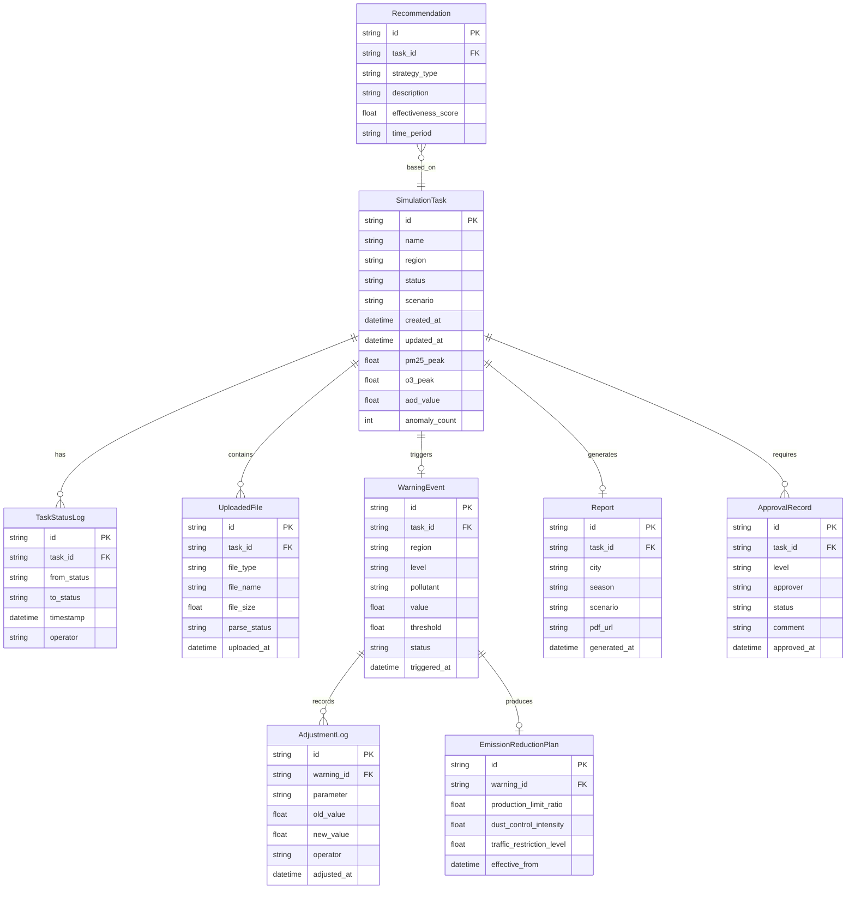

## 1. 架构设计

```mermaid
flowchart TB
    subgraph "前端层"
        "React SPA" --- "路由管理"
        "React SPA" --- "状态管理(Zustand)"
        "React SPA" --- "图表可视化(Recharts)"
        "React SPA" --- "3D渲染(Three.js)"
    end
    subgraph "数据层"
        "Mock数据服务" --- "模拟任务数据"
        "Mock数据服务" --- "监控实时数据"
        "Mock数据服务" --- "预警事件数据"
        "Mock数据服务" --- "报告数据"
        "Mock数据服务" --- "审批流程数据"
    end
    subgraph "业务逻辑层"
        "状态机引擎" --- "九态流转控制"
        "预警引擎" --- "阈值检测与分级"
        "推荐引擎" --- "策略匹配与排序"
        "审批引擎" --- "两级审批流程"
        "异常检测" --- "偏差计算与暂停"
    end
    "前端层" --> "业务逻辑层"
    "业务逻辑层" --> "数据层"
```

## 2. 技术说明

- **前端框架**：React@18 + TypeScript + Vite
- **样式方案**：Tailwind CSS@3
- **状态管理**：Zustand
- **路由**：react-router-dom@6
- **图表库**：Recharts（折线图、饼图、柱状图）、自定义Canvas（热力图）
- **3D渲染**：Three.js + @react-three/fiber + @react-three/drei
- **图标**：lucide-react
- **PDF生成**：html2canvas + jspdf（前端生成报告PDF）
- **初始化工具**：vite-init
- **后端**：无（纯前端项目，使用Mock数据模拟所有业务逻辑）
- **数据库**：无（使用Zustand store + localStorage持久化模拟数据）

## 3. 路由定义

| 路由 | 用途 |
|------|------|
| / | 重定向至 /dashboard |
| /dashboard | 综合看板页面，展示核心指标、趋势图、源贡献饼图 |
| /simulation | 模拟任务管理页面，任务创建、状态流转、文件上传 |
| /monitor | 实时监控页面，PM2.5/O3浓度曲线、光学厚度热力图 |
| /warning | 预警中心页面，预警列表、复核流程、削减方案调整 |
| /report | 报告中心页面，报告预览与PDF导出 |
| /recommend | 智能推荐页面，减排策略推荐与情景对比 |
| /approval | 审批中心页面，两级审批流程管理 |

## 4. 数据模型

### 4.1 数据模型定义



## 5. 核心业务逻辑

### 5.1 模拟任务状态机

九态流转：待校验(PENDING) → 数据融合(DATA_FUSION) → 网格生成(MESH_GENERATION) → 气相化学迭代(GAS_CHEMISTRY) → 气溶胶模拟(AEROSOL_SIM) → 云微物理(CLOUD_MICROPHYSICS) → 空气质量评估(AQ_ASSESSMENT) → 完成(COMPLETED) / 异常回退(ROLLBACK)

每个状态转换由定时器模拟自动推进，每个步骤停留3-8秒不等，模拟实际计算过程。

### 5.2 预警分级标准

| 级别 | PM2.5阈值(μg/m³) | O3阈值(μg/m³) | AOD阈值 | 推送目标 |
|------|-------------------|----------------|---------|----------|
| 红色(一级) | >250 | >400 | >2.0 | 应急指挥部 |
| 橙色(二级) | >150 | >265 | >1.5 | 空气质量预测中心 |
| 黄色(三级) | >115 | >215 | >1.0 | 环境监测中心 |
| 蓝色(四级) | >75 | >160 | >0.6 | 记录备案 |

### 5.3 异常检测规则

- 同一区域连续三次模拟的PM2.5峰值与该区域历史均值偏差超过30%时，自动暂停该区域新任务
- 暂停后系统自动通知首席科学家，由其决定是否恢复

### 5.4 智能推荐引擎

- 基于历史模拟结果中的气象条件（温度、湿度、风速）和排放情景进行聚类
- 对每个聚类中的成功减排方案按效果评分排序
- 新模拟任务根据当前气象条件匹配最相似的聚类，推荐Top3策略
